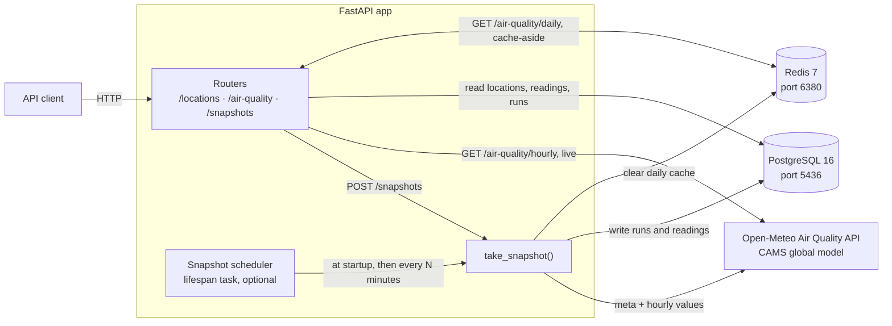

# FastAPI Air Quality

This local application is a hands-on FastAPI learning project. It uses air quality
figures from the CAMS global forecast model through Open-Meteo. These are model
estimates, not measurements from monitoring stations.

The app snapshots hourly PM2.5, PM10 and AQI values for five locations in Vietnam
(Hà Nội, Thành phố Hồ Chí Minh, Đà Nẵng, Điện Biên Phủ, Đà Lạt) into PostgreSQL,
then serves them as daily aggregates per local calendar day, cached in Redis.

## Architecture



Who writes and who reads each store:

| Store | Written by | Read by |
|---|---|---|
| `location` | Alembic migration `0001` (seeds the five locations) | `/locations`, `/air-quality/*` |
| `model_run` | `take_snapshot()` | `take_snapshot()` (new run or not, backfill window), `GET /snapshots` (`RunAt`) |
| `snapshot` | `take_snapshot()` (raw JSON per location and run) | Not read yet; kept for later analysis of forecast changes |
| `air_reading` | `take_snapshot()` (hourly values, newest run wins) | `GET /air-quality/daily` |
| `snapshot_run` | `take_snapshot()` (every attempt, including failures) | `GET /snapshots` |
| Redis `airq:daily:*` | `GET /air-quality/daily` on a cache miss | `GET /air-quality/daily`; cleared by `take_snapshot()` |

`take_snapshot()` is the only writer of snapshot data, whether it is called by
`POST /snapshots` or by the scheduler.

## Requirements

- Python 3.14 and [uv](https://docs.astral.sh/uv/)
- Docker (PostgreSQL 16 on host port 5436, Redis 7 on host port 6380, both bound to
  `127.0.0.1` only)

## Quick start

```powershell
Copy-Item .env.example .env          # then set SNAPSHOT_API_KEY
docker compose up -d
uv sync
uv run alembic upgrade head          # creates the tables and seeds the five locations
uv run fastapi dev app/main.py
```

Interactive API docs are served at `http://127.0.0.1:8000/docs`.

## API

Every response uses one envelope: `{"Data": ..., "Error": null | {"Code", "Message"}, "RequestId": ...}`.
JSON fields and query parameters are PascalCase. List parameters are comma-separated
(`Locations=hanoi,hcmc`) and location codes are case-insensitive.

| Method | Path | Notes |
|---|---|---|
| GET | `/health` | |
| GET | `/locations` | All locations |
| GET | `/locations/{code}` | One location; 404 for an unknown code |
| GET | `/air-quality/hourly?Locations=...` | Live hourly values fetched from Open-Meteo |
| GET | `/air-quality/daily?Locations=...&From=...&To=...` | Daily averages from stored readings, grouped by local date; cached in Redis |
| POST | `/snapshots` | Requires the `X-Api-Key` header. 201 new data · 200 nothing new · 409 a run is in progress · 502/503 upstream error |
| GET | `/snapshots?Limit=...&BeforeId=...` | Snapshot runs, newest first, with keyset pagination (`NextBeforeId`) |

## Snapshots: how data gets in

A snapshot runs on demand through `POST /snapshots`, or on a schedule while the app
is running. Both call the same `take_snapshot()`:

```
POST /snapshots (X-Api-Key) ──┐
scheduler (lifespan task) ────┴──► take_snapshot()
                                     │
                                     ├─ INSERT snapshot_run (running) ........ own transaction
                                     │
                                     ├─ advisory lock ── held by another run ──► failed / lock_held
                                     │                                          (POST answers 409)
                                     ├─ GET meta.json from Open-Meteo: which CAMS run is current?
                                     │
                                     ├─ run not available for 10 minutes yet ──► no_new_data
                                     ├─ run already in model_run ──────────────► check_count + 1
                                     │                                          ──► no_new_data
                                     └─ new run:
                                          GET hourly values for the 5 locations
                                            (past_days reaches back to the last stored run, max 92)
                                          INSERT model_run
                                          INSERT snapshot (raw JSON per location)
                                          UPSERT air_reading (only where this run is newer)
                                          COMMIT
                                          DEL airq:daily:* in Redis ..... after the commit
                                          ──► succeeded
                                     │
                                     └─ UPDATE snapshot_run (status, finished_at, error_code)
                                          ........ own transaction, also on failure or cancel
```

The run log is written in its own transactions, so a failed attempt is still recorded
when the snapshot transaction rolls back. `GET /snapshots` lists these runs.

The schedule is off by default; enable it in `.env`:

```
AIRQ_SNAPSHOT_SCHEDULER_ENABLED=true
AIRQ_SNAPSHOT_INTERVAL_MINUTES=60
```

```
app startup ──► lifespan ──► create_task(scheduler)
                                 │
                                 ├─► take_snapshot()      first pass right away
                                 ├─► sleep N minutes
                                 ├─► take_snapshot()      a failed pass is logged, loop goes on
                                 └─► ...
app shutdown ──► lifespan ──► cancel scheduler ──► close HTTP client, Redis, DB engine
                               (a pass cut short is recorded as failed / cancelled)
```

After the machine has been off, the first pass backfills the missed hourly values
through `past_days`. CAMS publishes a new run every 12 hours, so most passes end as
`no_new_data` after a single metadata request.

## Reading daily data

`GET /air-quality/daily` reads through the Redis cache:

```
GET /air-quality/daily?Locations=HCMC,Hanoi&From=2026-09-18&To=2026-09-19
   │
   │ key = airq:daily:hanoi,hcmc:2026-09-18:2026-09-19   (codes lowercased and sorted)
   ▼
Redis GET ── hit ──────────────────────────────────────────────► return cached days
   │
   │ miss, Redis unavailable, or an entry that no longer validates
   ▼
PostgreSQL: air_reading JOIN location, grouped by local date
   │
   ├──► Redis SET key, TTL 1 hour (skipped if Redis is unavailable)
   ▼
return days
```

A new snapshot clears every `airq:daily:*` key, so cached days never outlive new data
by more than the TTL. If Redis is down, every request reads the database.

## Tests

The tests use a real PostgreSQL database named `air_quality_test` and Redis database 1.
Create the test database once:

```powershell
docker exec airq-db createdb -U postgres air_quality_test
uv run pytest
```

The test fixtures create the tables and flush the test Redis database; the scheduler
is always off during tests.

## Labs

`labs/` holds small standalone scripts that reproduce one behaviour each, often a
failure on purpose (a stuck advisory lock, `asyncio.gather` on one session, lazy
loading without a greenlet, N+1 queries, lifespan in test clients, `TYPE_CHECKING`
imports in Pydantic models). Run one with `uv run python labs/<file>.py`.

## Data attribution

Air quality data come from the [Open-Meteo Air Quality API](https://open-meteo.com/en/docs/air-quality-api),
using [CAMS global atmospheric composition forecasts](https://ads.atmosphere.copernicus.eu/datasets/cams-global-atmospheric-composition-forecasts?tab=overview)
provided by the Copernicus Atmosphere Monitoring Service (CAMS).
Generated using Copernicus Atmosphere Monitoring Service information (2026).
The API data are available under [CC BY 4.0](https://open-meteo.com/en/terms).
Neither the European Commission nor ECMWF is responsible for any use of the
Copernicus information in this project; see the [Copernicus attribution terms](https://ads.atmosphere.copernicus.eu/licences/licence-to-use-copernicus-products).

## Status

The first phase is complete: the endpoints above, the snapshot job with its schedule,
the Redis cache and the test suite. Historical backfill beyond 92 days, authentication,
CI and deployment are not implemented.
